# Augustine Eyongtarh Besong - Portfolio

A modern, responsive, and interactive portfolio website showcasing my skills, experience, education, and projects as a **Full Stack Software Developer**. Built with **React**, **Vite**, and **Framer Motion**, the website emphasises performance, accessibility, and clean user experience with a premium glassmorphism-inspired design.

[](#)
[](#)
[](#)
[](LICENSE)


[](https://eyongtarh-portfolio.vercel.app/)

---

**Deployed website: [Link to website](https://eyongtarh-portfolio.vercel.app/)**

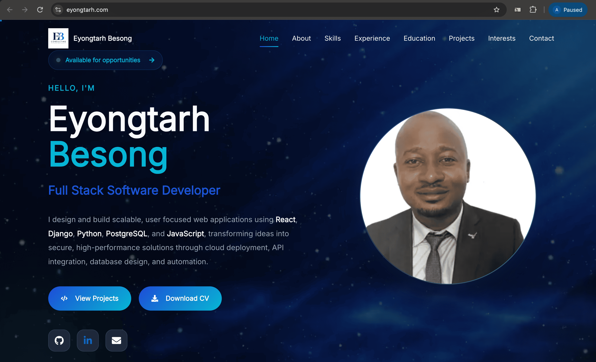

---

## Table of Contents

- [Features](#features)
- [Tech Stack](#tech-stack)
- [Project Structure](#project-structure)
- [Featured Projects](#featured-projects)
- [Website Sections](#website-sections)
- [Installation](#installation)
- [Wireframes](#wireframes)
- [Testing](#testing)
- [Deployment](#deployment)
- [About Me](#about-me)
- [Contact](#contact)
- [Future Enhancements](#future-enhancements)
- [Credits](#credits)
- [Support](#support)
- [License](#license)

---

## Features

- Responsive design for desktop, tablet, and mobile
- Smooth animations with Framer Motion
- GitHub API integration for project data
- Project filtering by category
- Downloadable CV
- Modern, reusable React components
- Clean and maintainable code structure
- Smooth scrolling navigation
- Animated hero section
- Glassmorphism UI elements
- Interactive project showcase
- Skills section with technology icons
- Experience timeline
- Education timeline
- Interests section
- Contact section
- Social media integration
- Active navigation highlighting
- Mobile-friendly navigation menu
- Scroll animations using Framer Motion
- Optimised images and performance
- Accessibility best practices

<p align="right">(<a href="#top">Back to Top ↑</a>)</p>

---

## Tech Stack

### Frontend

- React 19
- Vite
- JavaScript (ES6+)
- HTML5
- CSS3
- Framer Motion
- Font Awesome

### Backend Experience

Although this portfolio is frontend-based, my primary backend technologies include:

- Django
- Django REST Framework
- PostgreSQL
- SQLite

### Development Tools

- Git
- GitHub
- VSCode
- npm

<p align="right">(<a href="#top">Back to Top ↑</a>)</p>

---

## Project Structure

```text
Eyongtarh-portfolio/
├── public/
│   ├── captions/
│   │   └── empty.vtt                 # Caption track for hero background video
│   │
│   ├── errors/
│   │   └── 404.png                  # Custom 404 illustration
│   │
│   ├── images/
│   │   └── projects/                # Project screenshots
│   │       ├── about.png
│   │       ├── about2.png
│   │       ├── axe_report.png
│   │       ├── contact.png
│   │       └── ...
│   │
│   ├── 404.html                     # SPA fallback page
│   ├── cv.pdf                       # Downloadable CV
│   ├── favicon.ico
│   ├── humans.txt
│   ├── logo.png
│   ├── og-image.png                 # Social sharing image
│   ├── profile.webp                 # Optimised profile image
│   ├── robots.txt
│   ├── security.txt
│   ├── site.webmanifest
│   └── sitemap.xml
│
├── src/
│   ├── assets/
│   │   ├── errors/                  # Error page assets
│   │   ├── icons/                   # Custom SVG icons
│   │   ├── images/                  # Local images
│   │   ├── styles/                  # Shared styles
│   │   └── videos/                  # Hero background videos
│   │
│   ├── components/
│   │   ├── About/
│   │   ├── AnimatedBackground/
│   │   ├── Contact/
│   │   ├── CursorGlow/
│   │   ├── Education/
│   │   ├── Experience/
│   │   ├── Footer/
│   │   ├── Hero/
│   │   ├── Interests/
│   │   ├── LoadingScreen/
│   │   ├── Navbar/
│   │   ├── Projects/
│   │   ├── ScrollProgress/
│   │   ├── Skills/
│   │   ├── ErrorBoundary.jsx
│   │   └── ErrorIllustration.jsx
│   │
│   ├── data/
│   │   ├── experience.js
│   │   ├── github-repos.json
│   │   ├── projects.js
│   │   └── skills.js
│   │
│   ├── hooks/
│   │   ├── useGithubRepos.js
│   │   └── useLoading.js
│   │
│   ├── pages/
│   │   ├── AccessDenied.jsx
│   │   ├── LoadingError.jsx
│   │   ├── Maintenance.jsx
│   │   ├── NotFound.jsx
│   │   └── ServerError.jsx
│   │
│   ├── utils/
│   │   └── emailjs.js
│   │
│   ├── App.css
│   ├── App.jsx
│   └── main.jsx
│
├── .env
├── .gitignore
├── eslint.config.js
├── index.html
├── package.json
├── package-lock.json
├── postcss.config.js
├── vite.config.js
└── README.md
```

## Architecture

The portfolio follows a component based architecture using **React** and **Vite**, with each major section organised into its own directory.

### Core Components

- **Hero** : Landing section with animated introduction and background video.
- **About** : Professional summary and personal information.
- **Skills** : Categorised technical skills with animated technology badges.
- **Experience** : Professional work experience timeline.
- **Education** : Academic background and certifications.
- **Projects** : Featured GitHub projects with filtering and project cards.
- **Interests** : Personal interests and hobbies.
- **Contact** : Contact form and social links.
- **Footer** : Copyright and navigation links.

### Supporting Components

- Animated Background
- Cursor Glow
- Scroll Progress Indicator
- Loading Screen
- Error Boundary

### Data Layer

Project information is generated by combining:

- `github-repos.json` – GitHub repository data generated at build time.
- `projects.js` – Custom metadata including descriptions, images, categories, featured projects, live demos, and display order.

This approach avoids runtime API requests, resulting in faster page loads and improved Lighthouse performance.

### Custom Hooks

- **useGithubRepos** : Processes and merges GitHub repository data with custom project metadata.
- **useLoading** : Controls the initial loading screen animation.

### Performance Optimisations

- Lazy-loaded components with `React.lazy()` and `Suspense`
- Static GitHub data (no runtime API requests)
- Optimised WebP images
- Compressed hero background video
- Local font loading
- Framer Motion scroll animations
- Responsive layout with modern CSS

<p align="right">(<a href="#top">Back to Top ↑</a>)</p>

---

## Featured Projects

- **Eyongtarh Portfolio**: Responsive personal portfolio showcasing projects, skills, and professional experience, built with React, JavaScript, and Vite.

- **Ekpaw Spicies** : Python business automation with Google Sheets
  integration.

- **Riders Club** : Full-stack Django application for a
  motorcycle/bicycle club.

- **Tarh TastyHub** : Restaurant and food ordering platform with
  Stripe payments.

<p align="right">(<a href="#top">Back to Top ↑</a>)</p>

---

## Website Sections

### Home

A welcoming hero section introducing who I am, along with social links and quick navigation.


### About

It contains an overview of my background, passion for software development, and career goals.

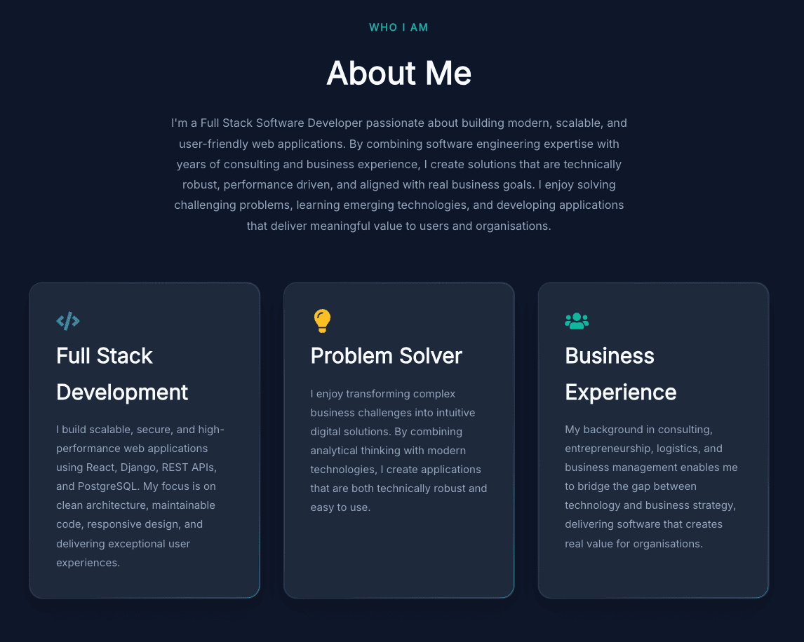

### Skills & Technologies

This section is made up of a collection of technologies, programming languages, frameworks, and tools I use.

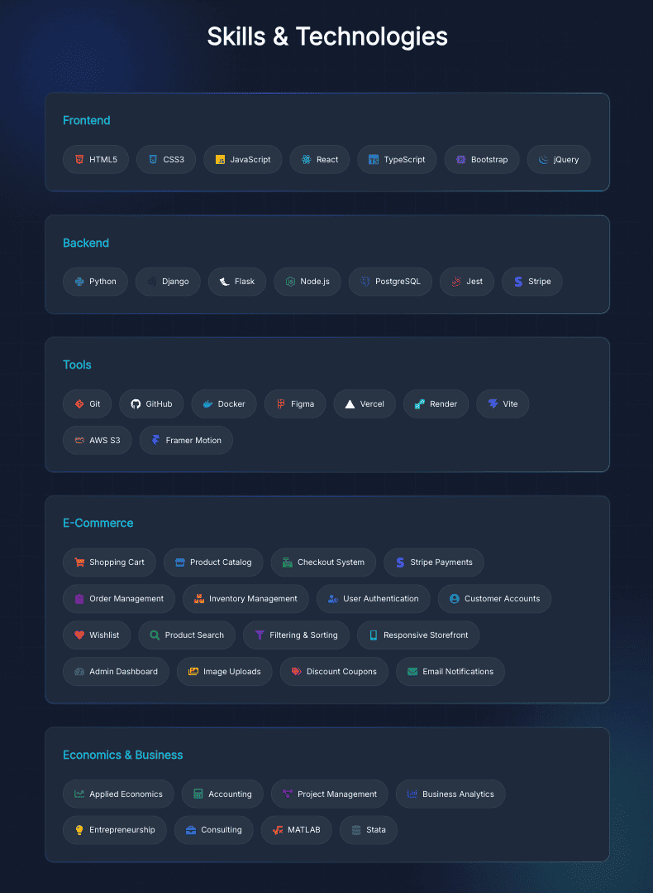

### Professional Experience

This section presents my professional and practical experience highlighting responsibilities and achievements.

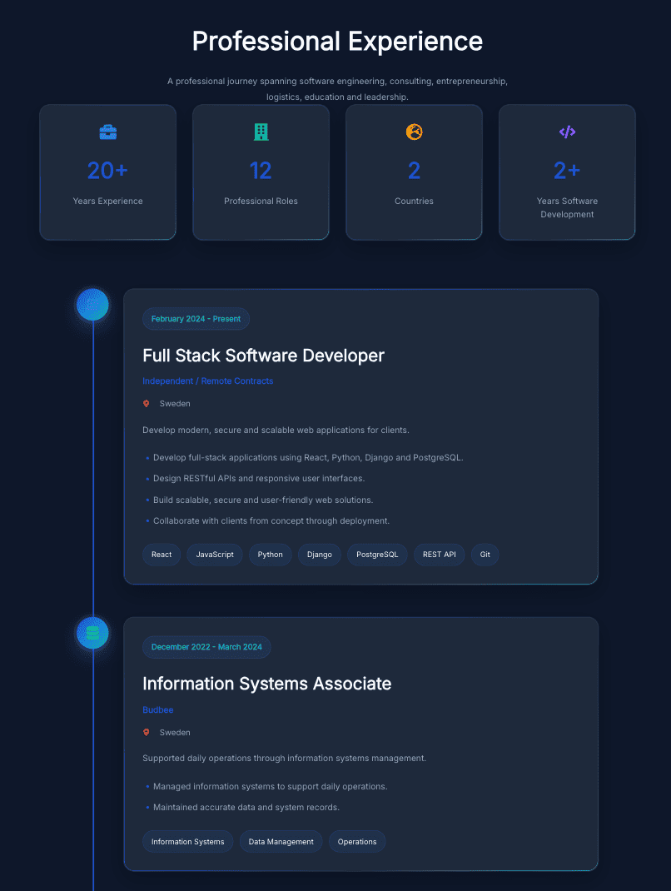

### Education

Academic background, certifications, and continuous learning journey.

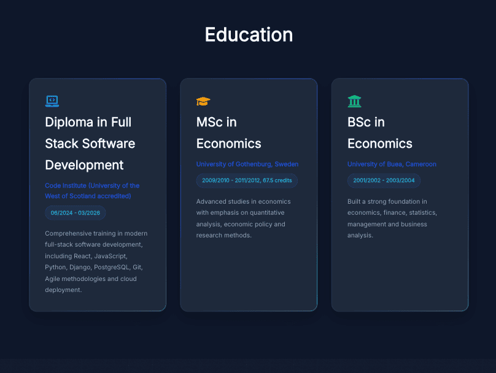

### Featured Projects

A showcase of selected software development projects demonstrating practical experience.


### Interests

Personal interests that complement my professional growth and creativity.

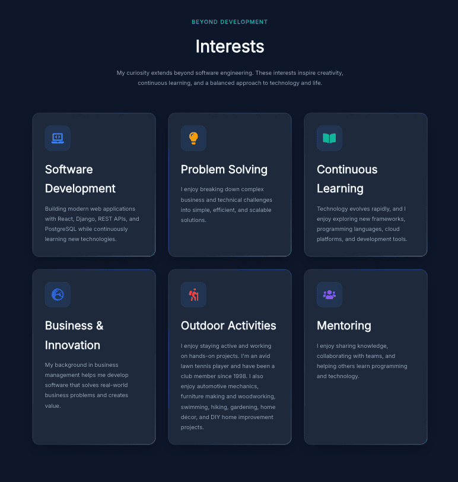

### Contact

Multiple ways to connect through email and professional social platforms.

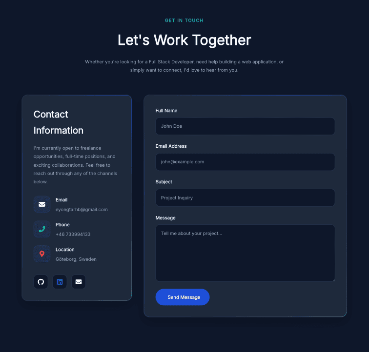

### Footer

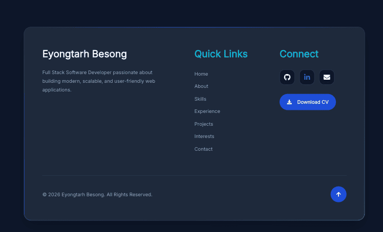

<p align="right">(<a href="#top">Back to Top ↑</a>)</p>

---

## Installation

Clone the repository:

```bash
git clone https://github.com/Eyongtarh/eyongtarh-portfolio.git
```

Navigate to the project:

```bash
cd eyongtarh-portfolio
```

Install dependencies:

```bash
npm install
```

Start the development server:

```bash
npm run dev
```

Open your browser and visit:

```
http://localhost:5173
```

<p align="right">(<a href="#top">Back to Top ↑</a>)</p>

---

## Wireframes

The portfolio was planned and designed using **Figma** before development began. Creating wireframes helped define the overall layout, user flow, and responsive structure for both desktop and mobile devices.

The wireframes served as a blueprint for organising the portfolio's content, including:

- **Navigation** :Sticky navigation bar with links to each section.
- **Hero** : Introduction, profile image, call-to-action buttons, and social links.
- **About** : Personal introduction and professional summary.
- **Skills** : Technical skills grouped by category.
- **Projects** : Featured projects with screenshots, descriptions, technologies, and repository/demo links.
- **Experience** : Professional experience presented in a timeline layout.
- **Education** : Academic background and certifications.
- **Contact** : Contact form and social media links.
- **Footer** : Copyright information and quick navigation links.

The final implementation closely follows the original wireframe while incorporating modern UI enhancements, animations, glassmorphism effects, and responsive design for an improved user experience.

### Desktop & Mobile Wireframes

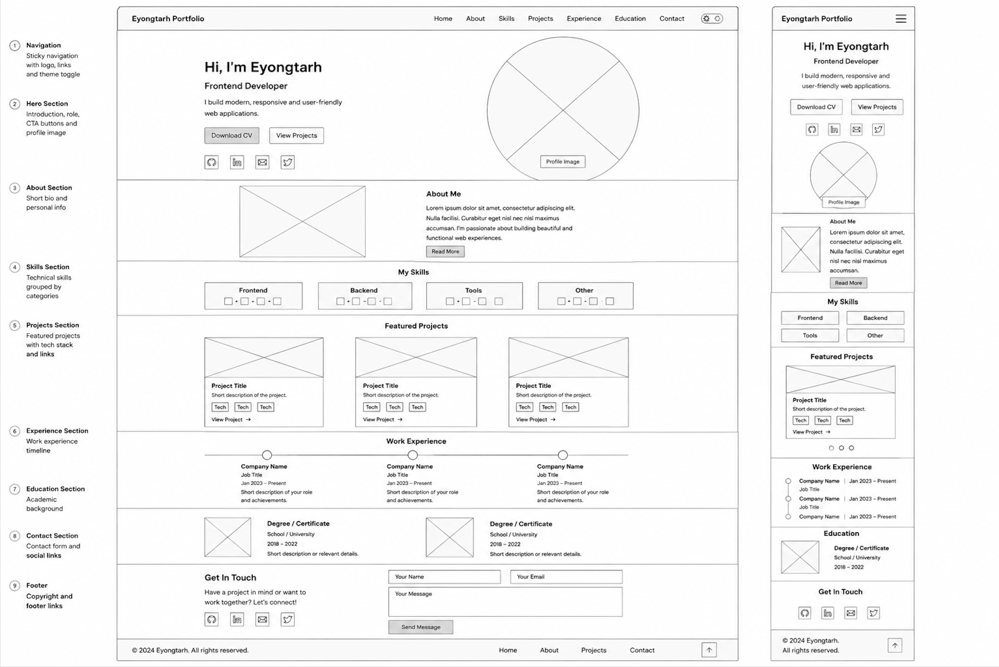

> _Figure: Low-fidelity desktop and mobile wireframes created during the planning phase of the Eyongtarh Portfolio project._

<p align="right">(<a href="#top">Back to Top ↑</a>)</p>

---

## Testing

### JavaScript Validation

JavaScript and JSX code were validated using **ESLint**, which is included in the Vite development environment. ESLint was used throughout development to identify syntax errors, enforce best practices, and maintain consistent code quality.

The project was checked by running:

```bash
npm run lint
```

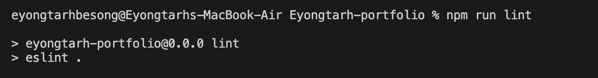

No errors were reported after the final review.

### Responsiveness

The responsiveness was checked manually by using devtools (Chrome) throughout the whole development. [Responsive Viewer](https://chrome.google.com/webstore/detail/responsive-viewer/inmopeiepgfljkpkidclfgbgbmfcennb/related?hl=en) Chrome extension.

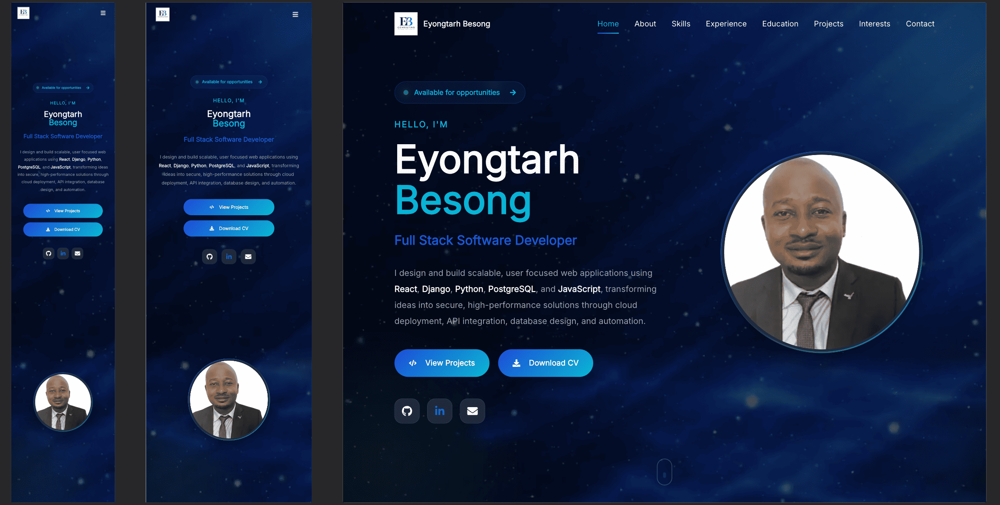

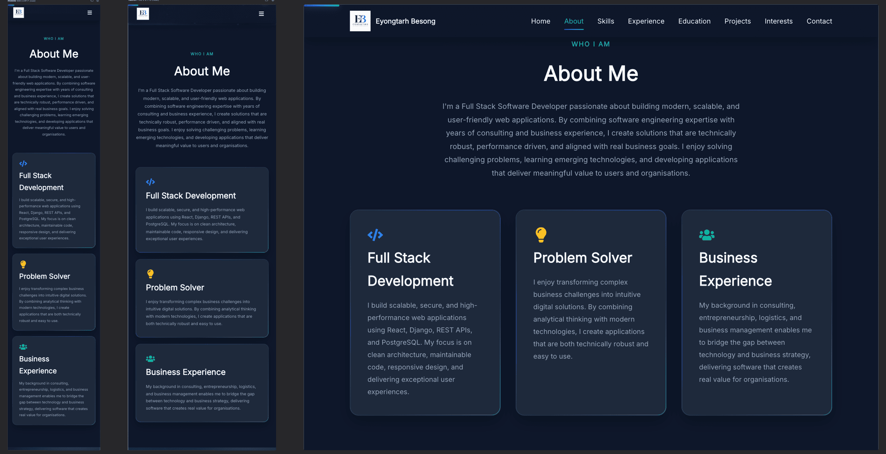

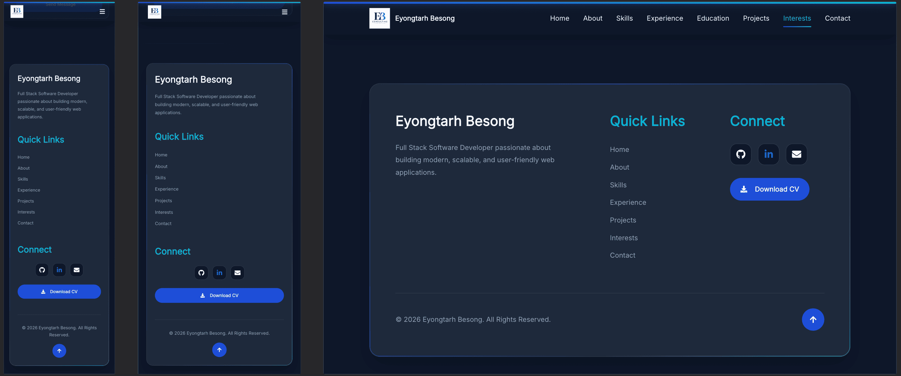

### Lighthouse Report

The portfolio was audited using **Google Lighthouse** in Google Chrome to evaluate its overall quality, including:

- Performance
- Accessibility
- Best Practices
- SEO

The report demonstrates that the application follows modern web development standards and optimisation practices.

- Desktop

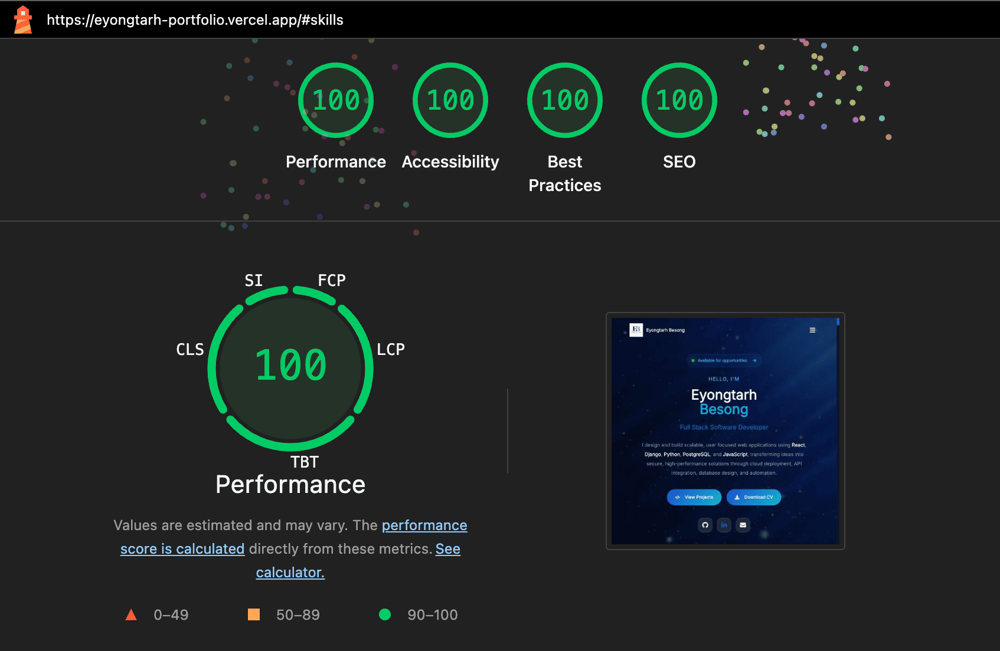

- Mobile

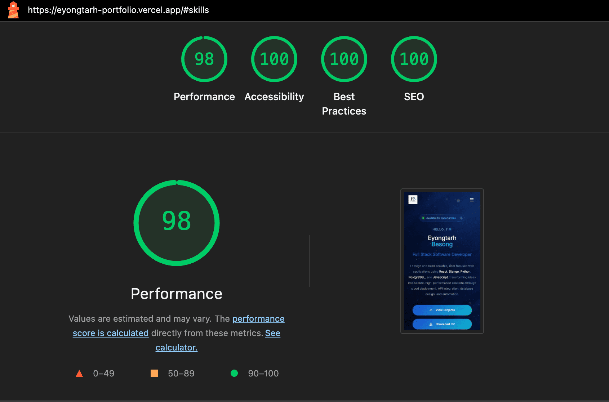

### Axe DevTools Accessibility Report

The portfolio was tested using **axe DevTools** to evaluate its accessibility and identify potential issues related to WCAG compliance. The report helps ensure the website is accessible, usable, and inclusive for all users.

- 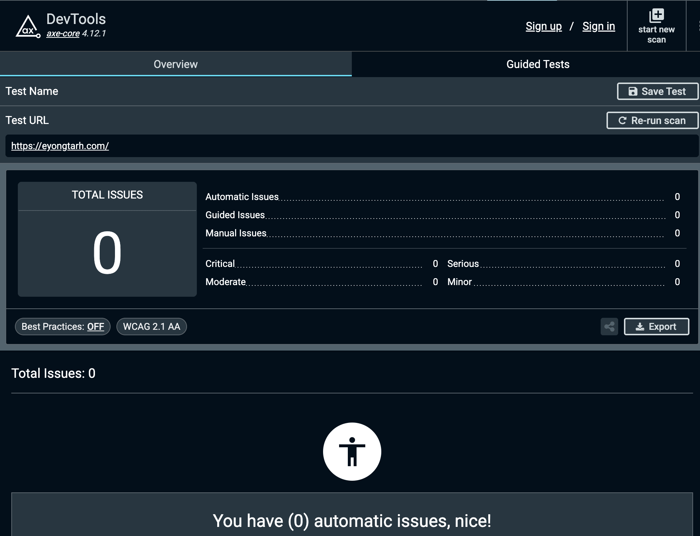

### CSS Validation:

**Note on W3C CSS Validation**

The W3C CSS Validator reports errors for several `::before` pseudo-elements that use modern CSS masking techniques, such as:

```css
mask:
  linear-gradient(#fff 0 0) content-box,
  linear-gradient(#fff 0 0);
-webkit-mask:
  linear-gradient(#fff 0 0) content-box,
  linear-gradient(#fff 0 0);
mask-composite: exclude;
-webkit-mask-composite: xor;
```

These styles are intentionally used to create animated gradient borders around cards and UI elements. Although the validator flags them as invalid or incomplete, they are supported by modern browsers (Chrome, Edge, Safari, and recent Firefox versions) and render correctly in production.

The reported validation errors are due to the W3C validator not fully supporting these newer CSS masking features and do not affect the functionality or appearance of the website.

[W3C (Jigsaw)](https://jigsaw.w3.org/css-validator/#validate_by_uri) validator. The css code works perfectly on various devices.

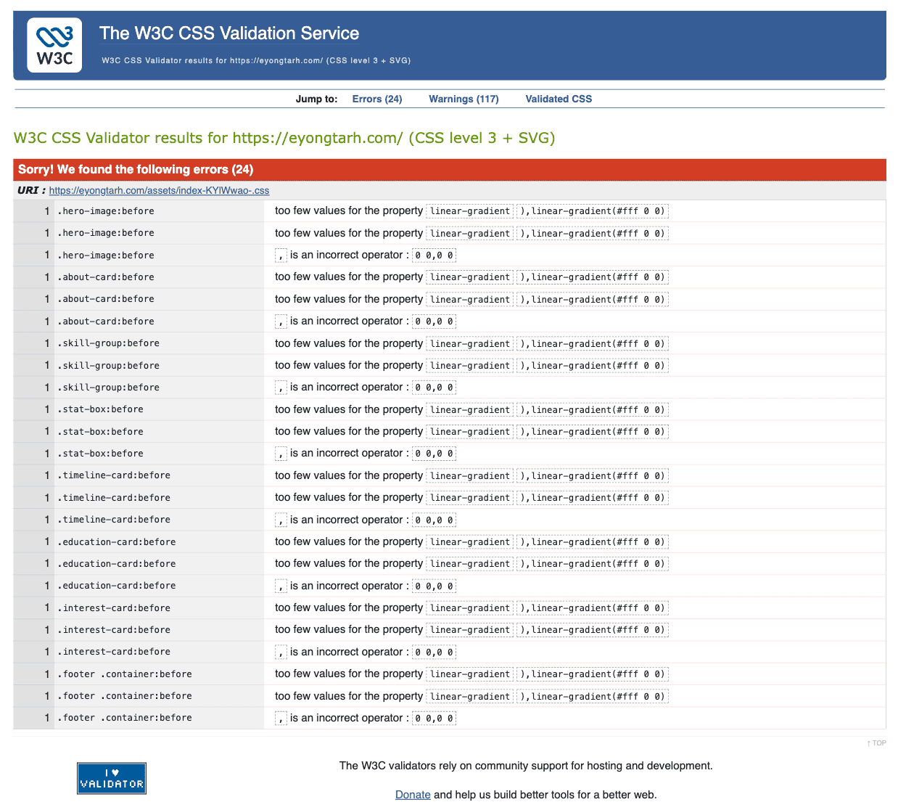

### HTML Validation:

No errors or warnings were found when passing through the official [W3C](https://validator.w3.org/) validator. This checking was done manually by copying the view page source code and pasting it into the validator.

- 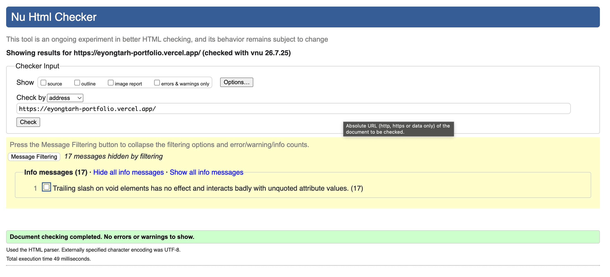

<p align="right">(<a href="#top">Back to Top ↑</a>)</p>

---

## Deployment

This portfolio is deployed on **Vercel**, providing fast global delivery, automatic HTTPS, and seamless continuous deployment from GitHub.

### Build for Production

Generate an optimised production build:

```bash
npm run build
```

The optimised production files are generated in the `dist/` directory.

### Preview the Production Build

Preview the production build locally before deployment:

```bash
npm run preview
```

### Continuous Deployment

The project is connected to GitHub through Vercel. Every push to the **main** branch automatically triggers a new production deployment, ensuring the live portfolio is always up to date.

### Production Features

The deployed application includes:

- Optimised production builds with Vite
- Automatic code splitting and tree shaking
- JavaScript and CSS minification
- Global CDN delivery via Vercel
- Automatic HTTPS with SSL
- Fully responsive design
- Accessible and optimised for modern browsers

<p align="right">(<a href="#top">Back to Top ↑</a>)</p>

---

## About Me

I'm a Full Stack Developer with experience building responsive web
applications using React, Django, PostgreSQL, and JavaScript. I enjoy
creating software that combines clean engineering with practical
business value.

---

## Contact

- GitHub: https://github.com/Eyongtarh

- LinkedIn: [A. Eyongtarh Besong](https://www.linkedin.com/in/a-eyongtarh-besong-22ab9b281/?lipi=urn%3Ali%3Apage%3Ad_flagship3_profile_view_base_contact_details%3BgfF4x%2F3lTTafsvXLjJKu3A%3D%3D)

- Email: eyongtarhb@gmail.com

---

## Future Enhancements

- Add a blog section
- Add dark/light theme switching
- Integrate a CMS for project management
- Add multilingual support
- Add automated testing

<p align="right">(<a href="#top">Back to Top ↑</a>)</p>

---

## Credits

The following technologies, tools, and resources were used in the development of this portfolio:

### Technologies

- **React** : JavaScript library for building the user interface.
- **Vite** : Frontend build tool and development server.
- **JavaScript (ES6+)** : Application logic and interactivity.
- **HTML5** : Semantic page structure.
- **CSS3** –:Custom styling, animations, and responsive layouts.
- **Framer Motion** : Smooth animations and page transitions.
- **Font Awesome** : Icons used throughout the portfolio.

### Development Tools

- **Visual Studio Code** : Primary code editor.
- **Git** : Version control.
- **GitHub** : Source code hosting and repository management.
- **Vercel** : Application hosting and continuous deployment.
- **Google Chrome DevTools** : Debugging, testing, and performance analysis.

### Testing & Validation

- **Google Lighthouse** : Performance, Accessibility, Best Practices, and SEO audits.
- **axe DevTools** : Evaluated the portfolio for accessibility issues and WCAG compliance.
- **W3C HTML Validator** : HTML validation.
- **W3C CSS Validator** : CSS validation.
- **JavaScript and JSX code Validation** : ESLint.
- **Responsiveness Validation** : Responsive Viewer.

### Design & Assets

- **Google Fonts** : Typography.
- **Figma** : UI design, wireframes, and design planning.
- **favicon.io** : Favicon generation.
- **CompressPNG** : Image compression.
- **IMGonline** – Image resizing and optimisation.

### Acknowledgements

Special thanks to the open-source community for providing the libraries, tools, and resources that made this project possible.

---

## Support

If you found this project helpful, consider giving the repository a ⭐ on GitHub.

---

## License

This project is licensed under the MIT License.

---

Made with ❤️ using React, Vite, and Framer Motion by **Eyongtarh Besong**.

<p align="right">(<a href="#top">Back to Top ↑</a>)</p>

```

```
